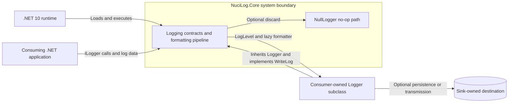
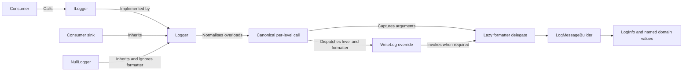
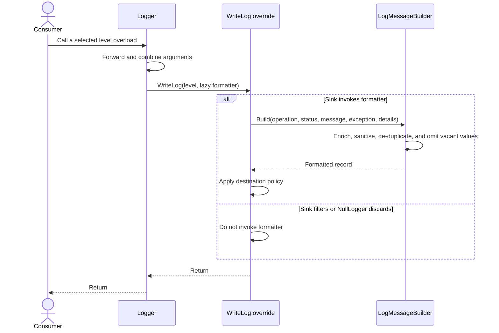
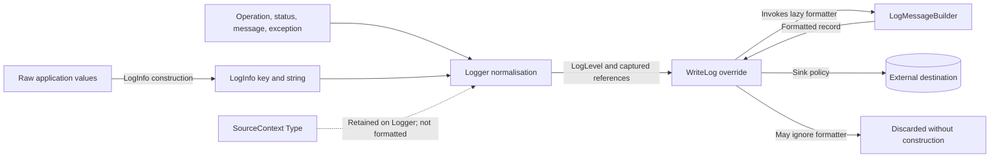
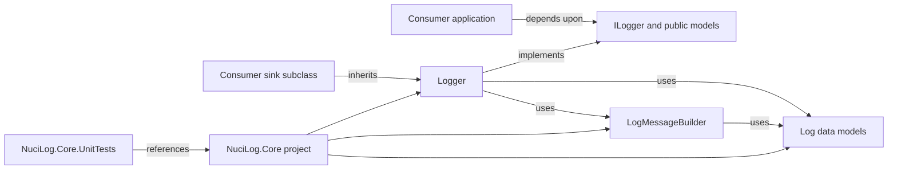

# NuciLog.Core Architecture

This document records the verified current architecture of NuciLog.Core 3.0.0: its library boundary, extension contracts, record-construction pipeline, verification project, and packaging model. Consumer composition and concrete log destinations remain external except where they implement library contracts.

## 📑 Table of Contents

- [Table of Contents](#-table-of-contents)
- [Purpose](#-purpose)
- [System Context](#-system-context)
- [Architectural Style](#-architectural-style)
- [Runtime Flow](#-runtime-flow)
- [Components](#-components)
- [Data Architecture](#-data-architecture)
- [Interfaces and Integrations](#-interfaces-and-integrations)
- [Record Construction](#-record-construction)
  - [Record Grammar](#record-grammar)
  - [Construction Policy](#construction-policy)
- [Cross-Cutting Concerns](#-cross-cutting-concerns)
  - [Security and Privacy](#security-and-privacy)
  - [Error Handling](#error-handling)
  - [Observability](#observability)
  - [Concurrency and Resource Use](#concurrency-and-resource-use)
- [Dependency Direction and Rules](#-dependency-direction-and-rules)
- [External Dependencies](#-external-dependencies)
- [Deployment and Operations](#-deployment-and-operations)
- [Compatibility Contracts](#-compatibility-contracts)
- [Testing and Verification](#-testing-and-verification)
- [Design Constraints](#-design-constraints)
- [Extension Points](#-extension-points)
  - [Concrete Log Sink](#concrete-log-sink)
  - [Structured Field Keys](#structured-field-keys)
  - [Domain Operations and Statuses](#domain-operations-and-statuses)
- [Architecture Decisions](#-architecture-decisions)
- [Source Map](#-source-map)
- [Related Documentation](#-related-documentation)

## 🎯 Purpose

NuciLog.Core supplies a compact logging abstraction for .NET applications. It standardises six levels, optional operation context, structured details, exception enrichment, and a predictable textual record while delegating filtering, transport, persistence, and presentation to a consumer-owned sink. This document assists maintainers, sink authors, and API consumers in locating ownership, tracing execution, and evaluating compatibility consequences. It documents implemented behaviour rather than a proposed target architecture.

## 🌐 System Context

The system boundary is the NuciLog.Core class library loaded into a consuming .NET process. Application code initiates every log operation and supplies all operation names, statuses, messages, exceptions, and structured values. The library owns overload normalisation and optional record construction; a derived logger owns the destination policy. NuciLog.Core owns no database, file, network connection, service process, authentication mechanism, or secret source.



The principal external boundaries are:
- **Consuming application:** Owns composition, logger lifetime, source data, and invocation of the public logging API.
- **Concrete sink and destination:** A consumer-derived `Logger` receives a `LogLevel` and lazy formatter, then decides whether, when, and where to emit the record.
- **.NET runtime:** Loads the `net10.0` assembly and supplies the base class library facilities used for collections, LINQ, text conversion, and regular expressions.
- **Persistent stores:** NuciLog.Core owns none; any retained record crosses into sink-owned storage and policy.
- **Trust boundary:** Application-supplied values and exception data enter the library without confidentiality classification or schema validation, then may cross into an external destination selected by the sink.

## 🏗️ Architectural Style

The repository implements a library/SDK architecture centred upon a public facade and Template Method-style sink hook. `ILogger` defines the consumer contract. `Logger` centralises a largely duplicated overload matrix and reduces each level to one canonical call. `LogMessageBuilder` performs stateless transformation only when the sink invokes the supplied delegate. Concrete subclasses complete the algorithm by implementing `WriteLog`; `NullLogger` supplies the null-object variant.



The principal architecture boundaries are:
- **Public contract boundary:** `ILogger`, `Logger`, and the public data types define the source- and binary-compatible surface consumed by applications.
- **Normalisation boundary:** `Logger` owns overload forwarding, detail-sequence combination, level selection, and lazy delegate creation; it performs no destination I/O.
- **Formatting boundary:** `LogMessageBuilder` owns field ordering, enrichment, sanitisation, de-duplication, omission, and serialisation into one string.
- **Sink boundary:** `WriteLog` transfers control to a subclass without introducing a dependency from the core library to any concrete destination.

## 🔄 Runtime Flow



The principal runtime sequence is:
1. Consumer composition creates a `NullLogger` or a concrete `Logger` subclass and may assign its `SourceContext`.
2. The consumer invokes one of the `Verbose`, `Debug`, `Info`, `Warn`, `Error`, or `Fatal` overloads.
3. `Logger` forwards arguments across the overload family. Where two detail sequences are supplied, null sequences are bypassed and two populated sequences are combined with LINQ `Union`.
4. The canonical overload invokes `WriteLog` synchronously with the selected `LogLevel` and a `Func<string>` that captures the formatting inputs.
5. The override may ignore the delegate, invoke it immediately, or retain it. Invocation calls `LogMessageBuilder.Build`, which returns the formatted record to the sink.
6. The sink owns any filtering, decoration, buffering, transmission, persistence, or display. Unhandled failures propagate from the boundary that executes them.

## 🧩 Components

| Component | Responsibility | Principal Dependencies | Lifetime or Ownership |
|-----------|----------------|------------------------|-----------------------|
| `ILogger` | Defines source context access and the six public logging overload families. | `Type`, `Operation`, `OperationStatus`, `Exception`, `LogInfo` | Public consumer contract; implementation lifetime is external. |
| `Logger` | Implements overload normalisation, combines detail sequences, selects the level, retains source context, and dispatches the lazy formatter. | `ILogger`, `LogMessageBuilder`, LINQ, public data types | Caller-owned instance; no disposal contract; `SourceContext` is mutable instance state. |
| `LogMessageBuilder` | Converts canonical inputs into the delimited structured record. | `LogInfo`, `LogInfoKey`, `Operation`, `OperationStatus`, LINQ, `Regex` | Process-static utility with a static compiled regular expression and method-local transformation state. |
| `LogInfo` | Captures one named structured value and converts supported object forms into strings. | `LogInfoKey`, collection interfaces, reflection, `StringBuilder` | Consumer- or builder-created value carrier; key reference and string value are read-only after construction. |
| `LogInfoKey` | Supplies name-based structured-field identity and reserved internal field names. | `IEquatable<LogInfoKey>` | Consumer-extendable named object; static properties create fresh built-in instances. |
| `Operation` and `OperationStatus` | Represent extensible operation context and provide built-in names. | None beyond the .NET base class library | Consumer-extendable named objects; built-in static properties create fresh instances. |
| `LogLevel` | Identifies severity independently from the formatted payload. | None | Value copied into each `WriteLog` call. |
| `NullLogger` | Implements the no-op sink by declining to invoke the formatter. | `Logger` | Caller-owned instance; retains inherited source context but emits and persists nothing. |

## 💾 Data Architecture

NuciLog.Core owns transient transformation data rather than persistent state. `LogInfo` converts an object value during construction; `Logger` subsequently captures references to canonical inputs in a delegate. Formatting is deferred until the sink invokes that delegate. The core library retains only `SourceContext` on each logger instance and does not cache records. A sink that retains the delegate also retains its captured references and assumes responsibility for their lifetime, consistency, confidentiality, and eventual disposal where applicable. There are no migrations or consistency protocols within the library.



| Data or Store | Owner | Representation and Storage | Lifecycle or Consistency |
|---------------|-------|----------------------------|--------------------------|
| `SourceContext` | `Logger` instance | Nullable `Type` reference with a private property setter | Null initially; assigned only via `SetSourceContext<T>()` or the virtual `SetSourceContext(Type)`, replaced on subsequent assignment, and not included in constructed records. |
| `LogInfo` | Consumer or `LogMessageBuilder` | `LogInfoKey` reference plus a string value | Converted at construction, passed transiently, and not persisted by the core library. |
| `Operation` and `OperationStatus` | Consumer | Named objects in memory | Passed by reference; omitted when null; status names are upper-cased during construction. |
| Exception enrichment | `LogMessageBuilder` | `Message`, exception type, exception message, and stack trace fields | Created only when the formatter is invoked; vacant final values are omitted. |
| Formatted record | Concrete sink | Ordered `key＝value` string | Created on demand; retention, consistency, and expiry are entirely sink-owned. |

## 🔌 Interfaces and Integrations

| Interface or Integration | Direction | Contract | Owner | Failure Semantics |
|--------------------------|-----------|----------|-------|-------------------|
| `ILogger` | Inbound | Synchronous .NET method calls for source context and six logging levels with optional operation, status, message, exception, and detail combinations. | NuciLog.Core | No exception translation or retry; failures from the selected implementation propagate to the caller. |
| `Logger.WriteLog` | Outbound control to subclass | Protected abstract `void WriteLog(LogLevel, Func<string>)`. The callback constructs only the structured payload; the level remains a separate argument. | Base contract owned by NuciLog.Core; execution policy owned by the subclass. | Override failures propagate synchronously; retained-callback failures occur wherever the sink later invokes the callback. |
| `LogMessageBuilder.Build` | Inbound utility and internal call | Public overloads accepting canonical inputs and returning one formatted string. | NuciLog.Core | Enumeration, conversion, malformed-value, and formatting failures propagate without translation or fallback. |
| `NullLogger` | Inbound | Complete `Logger` implementation that ignores `WriteLog` arguments. | NuciLog.Core | Returns without invoking the formatter or contacting an external system. |

## ⚙️ Record Construction

### Record Grammar

| Element | Current Contract |
|---------|------------------|
| Field form | `Name＝Value` |
| Assignment character | `＝` (`U+FF1D`, FULLWIDTH EQUALS SIGN) |
| Field separator | `͵` (`U+0375`, GREEK LOWER NUMERAL SIGN) |
| Record terminator | None; `LogMessageBuilder` does not append a newline. |
| Principal order | Operation, operation status, processed message/custom fields, then exception fields. |
| Severity | Passed separately as `LogLevel`; absent from the builder-produced string. |
| Missing data | Null operation/status and vacant processed values are omitted. |
| Duplicate processed keys | Keys compare by case-sensitive `LogInfoKey.Name`; the last value wins while the key retains its first field position. |

`LogInfo` converts null objects to an empty string; `DateTime` and `DateTimeOffset` to round-trip (`o`) form; `TimeSpan` to constant (`c`) form; enumerations to general (`G`) form; string arrays and non-dictionary enumerables by joining elements with `;`; dictionaries by appending each `key=value;` element; and other objects via `ToString`. Dedicated date/time constructors honour a consumer-supplied format.

### Construction Policy

Processed field construction follows this policy:
1. Append `Operation` with its original name when supplied.
2. Append `OperationStatus` with `Name.ToUpper()` when supplied.
3. Add a non-whitespace message, or add `An exception has occurred.` when an exception exists without such a message.
4. Enumerate custom `LogInfo` values and replace embedded CRLF, CR, or LF sequences with the literal characters `\n`.
5. For an exception, append its runtime type, sanitised message, and sanitised stack trace. Stack-trace processing converts newlines to literal `\n`, eliminates those literal sequences, replaces literal `\t` sequences with spaces, and trims the result. Vacant fields disappear during final filtering.
6. Group message, custom, and exception fields by name-based key equality, retain each group's last value, and omit null, empty, or whitespace final values.
7. Serialise fields with the fixed assignment and separator characters, then omit the final separator.

Operation and status prefixes are constructed external to the de-duplication pipeline. Field names and values containing `＝` or `͵` are not escaped, so downstream parsing must account for this limitation.

## 🧵 Cross-Cutting Concerns

### Security and Privacy

NuciLog.Core performs no authentication, authorisation, secret acquisition, or destination access. The builder replaces newlines only in processed message, detail-value, exception-message, and stack-trace fields; operation names, status names, and key names are not sanitised. This processing limits some multi-line record injection but is not a confidentiality control and does not escape the record delimiters. Logged inputs can contain personal data, secrets, filesystem locations, or other sensitive material. Consumers must minimise and redact data prior to logging, while sink implementations must apply destination access, transport protection, retention, and disclosure policy. `NullLogger` avoids materialising captured content because it never invokes the formatter.

### Error Handling

The base library contains no catch, retry, fallback, or error-translation boundary. Null detail collections are deliberately accommodated, and vacant values are omitted. Conversely, malformed custom keys or names, enumerator failures, reflection failures, consumer `ToString` failures, builder failures, and sink failures can escape. Immediate callback execution places formatting failures on the original logging call; deferred execution transfers that failure context to the sink. The caller or sink therefore owns any policy that prevents logging failures from affecting its principal operation.

### Observability

The library's sole diagnostic signal is the `LogLevel` plus optional formatted record transferred to `WriteLog`. It emits no metrics, traces, health status, internal diagnostics, timestamps, correlation identifiers, or destination metadata. Consumers can add correlation data via custom `LogInfoKey` values, and sinks can decorate records. `SourceContext` is retained on `Logger` but is not supplied to `LogMessageBuilder` or emitted automatically.

### Concurrency and Resource Use

Logging methods and `WriteLog` are synchronous at the base boundary, but the delegate contract permits a sink to defer or parallelise formatting. `Logger` provides no locks, queues, cancellation, backpressure, or concurrency declaration. Its mutable `SourceContext` can race when a shared instance is reassigned or when a subclass reads it during emission. The lazy delegate captures input references without copying the outer detail sequence; delayed invocation can therefore observe subsequent collection or named-object mutation. Record construction allocates strings and LINQ groupings, and neither detail count nor final record length is bounded. Logger lifetime, synchronisation, queue bounds, and delegate retention are sink and consumer responsibilities.

## 🧭 Dependency Direction and Rules

Stable public contracts occupy the inward boundary. `Logger` depends upon `ILogger`, public data models, and `LogMessageBuilder`; the builder depends upon the named value types and .NET base class library. A concrete sink depends upon `Logger`, despite runtime control returning to its override. Unit tests depend upon the production project, while production has no dependency upon tests or sink implementations.



The principal dependency rules are:
- Consumer code may depend upon `ILogger` alone or upon `Logger` when implementing a sink.
- Destination-specific I/O, filtering, buffering, and configuration remain in the concrete sink rather than `Logger` or `LogMessageBuilder`.
- `LogMessageBuilder` receives canonical data and does not call a sink or mutate logger state.
- The production project does not reference its test project, NUnit, destination frameworks, or consumer assemblies.
- Extension types depend upon `LogInfoKey`, `Operation`, or `OperationStatus`; the core library does not discover or register them.

## 📦 External Dependencies

| Dependency | Responsibility | Integration Boundary | Architectural Consequence |
|------------|----------------|----------------------|---------------------------|
| `.NET 10` | Runtime, compiler target, and base class library. | `net10.0` target framework in the production and test projects. | Consumers require a compatible .NET 10 environment; the package is not multi-targeted. |
| `Microsoft.SourceLink.GitHub` 10.0.300 | Produces source-linked symbols for package diagnostics. | Production project compilation and packing only. | `PrivateAssets="all"` prevents transitive exposure to consumers; it has no runtime role. |
| NUnit test toolchain | Discovers and executes unit tests via `Microsoft.NET.Test.Sdk`, NUnit, and `NUnit3TestAdapter`. | Test project only. | Verification depends upon these package versions but production consumers do not. |

The test project also references Moq, although the tracked test sources use a concrete `TestLogger` rather than Moq. Current restore reports `NU1902` for the transitive build dependency `Microsoft.Build.Tasks.Git` 10.0.300; this is a build-supply-chain maintenance concern rather than a runtime dependency of NuciLog.Core consumers.

## 🚀 Deployment and Operations

NuciLog.Core is deployed as an in-process class library rather than an independent service. The production project emits a `net10.0` assembly and can produce a NuGet package plus `.snupkg` symbols. Package generation is not coupled to normal compilation, and the repository contains no automated publication job. The consuming process owns construction, dependency-injection registration, lifetime, startup, shutdown, and all destination resources. `Logger` implements no disposal interface and opens no resources itself.

| Concern | Current Design | Architectural Consequence |
|---------|----------------|---------------------------|
| Process topology | One library loaded into each consuming .NET process. | Availability, isolation, and process termination correspond to the host application. |
| Persistent state | Only per-instance `SourceContext` is retained by the core; records are transient. | Recovery, retention, and storage durability are sink-owned. |
| Scaling | No global coordinator or shared persistent resource exists. | Scaling follows host instances, subject to each sink's own synchronisation and destination capacity. |
| I/O | The base library performs none; `NullLogger` discards and custom subclasses select destinations. | Filesystem, network, credentials, retries, and disposal remain external responsibilities. |
| Packaging | Version 3.0.0, `net10.0`, NuGet metadata, Source Link, and symbol package configuration reside in the production project. | Target-framework or public-contract changes affect package compatibility. |
| Continuous integration | The GitHub Actions workflow restores, compiles, and tests on Ubuntu with .NET 10 for `master` pushes and pull requests. | CI verifies one operating system and performs no package publication. |

## 🛡️ Compatibility Contracts

| Contract | Owner | Invariant | Verification | Change Policy |
|----------|-------|-----------|--------------|---------------|
| Public logging API | `ILogger` and `Logger` | Six level families, source-context members, overload signatures, and protected `WriteLog(LogLevel, Func<string>)` remain callable by existing consumers and subclasses. | Compilation plus mirrored logger unit suites. | Treat incompatible signature, visibility, or abstract-member changes as deliberate breaking package changes and revise consumers, tests, and documentation together. |
| `LogLevel` values | `LogLevel` | `Fatal=0`, `Error=1`, `Warn=2`, `Info=3`, `Debug=4`, `Verbose=5`. | Source declaration; no dedicated numeric-value test currently exists. | Preserve observable numeric assignments unless a deliberate breaking change is planned. |
| Record grammar | `LogMessageBuilder` | Fixed field order, `＝` assignment, `͵` separation, no terminator, and severity external to the payload. | `LogMessageBuilderTests` and every logger-level suite assert complete strings. | Grammar changes require coordinated parser migration and revised assertions. |
| Key identity and de-duplication | `LogInfoKey` and `LogMessageBuilder` | Case-sensitive name equality; first-position ordering with the last processed value selected; vacant final value removes the field. | Duplicate-key and vacant-value unit tests. | Key-name or equality changes require compatibility analysis for custom key subclasses. |
| Value conversion | `LogInfo` | Round-trip date/time, constant duration, general enumeration, semicolon collection, dictionary, and fallback `ToString` rules. | `LogInfoTests`. | Conversion changes alter emitted records and require explicit test and documentation revision. |
| Exception enrichment | `LogMessageBuilder` | Default message when absent, followed by exception type, message, and non-vacant stack trace fields. | Builder and logger-level exception tests. | Preserve names and order or provide a deliberate downstream migration. |
| Lazy sink hook | `Logger` subclasses | The sink receives level and formatter separately and decides whether to invoke the formatter. | `TestLogger` invokes the delegate; `NullLogger` implementation demonstrates omission. | Preserve laziness and delegate semantics for existing sink subclasses. |

## ✅ Testing and Verification

[NuciLog.Core.UnitTests](NuciLog.Core.UnitTests/) is an NUnit project that references the production project directly. Six logger suites mirror the six severity families and verify overload routing, level selection, null handling, detail combination, and complete record strings via `TestLogger`. `LogMessageBuilderTests` verifies ordering, omission, newline sanitisation, exception enrichment, and duplicate-key semantics. `LogInfoTests` verifies supported object-to-string conversions.

Current verification gaps are:
- No explicit tests cover `SourceContext`, `NullLogger`, `LogInfoKey` equality in isolation, or the numeric `LogLevel` assignments.
- No test compares the complete `ILogger` and `Logger` overload surfaces.
- No test exercises a populated stack trace, delayed formatter invocation, concurrent source-context mutation, or a real destination adapter.
- No benchmark or capacity test establishes allocation, detail-count, or record-length limits.
- CI verifies Ubuntu only and does not pack or publish the package.

Execute the principal automated verification with:

```bash
dotnet test NuciLog.sln --verbosity normal
```

This command currently compiles both projects and passes 509 tests. Restore also emits the build-supply-chain `NU1902` warning identified in External Dependencies.

## ⚠️ Design Constraints

- **Destination neutrality:** The core supplies no console, file, network, filtering, timestamp, or configuration implementation. Every effective destination requires a `Logger` subclass external to the library.
- **Fixed unversioned record format:** Delimiters, ordering, reserved names, and exception enrichment are hard-coded. The grammar has no explicit version marker and does not escape its own Unicode delimiters.
- **Deferred input lifetime:** The lazy formatter captures references and can enumerate details after the public call if retained by a sink; the core provides no snapshot or retention limit.
- **Mutable source context:** `SourceContext` is mutable, unsynchronised, and currently disconnected from record construction.
- **Culture-sensitive extension names:** `OperationStatus.Name.ToUpper()` and several general object conversions use ambient formatting behaviour, so custom values can vary by current culture.
- **Manual overload surface:** Six large overload families are maintained manually across `ILogger` and `Logger`, increasing parity and compatibility risk even though the implementation centralises terminal behaviour.
- **Interface/base asymmetry:** `Logger` exposes `Verbose(Operation, OperationStatus, string, Exception, IEnumerable<LogInfo>)`, while `ILogger` omits that exact declaration and relies upon its corresponding `IEnumerable<LogInfo>, params LogInfo[]` overload for the identical five-argument call form. Reflection and independent interface implementations therefore observe different surfaces.
- **Input validation:** Public constructors and builders do not validate key references, names, delimiter content, or record size; malformed custom inputs can produce ambiguous records or exceptions.
- **Target-framework scope:** Both projects target only .NET 10, excluding consumers on earlier target frameworks without a compatible asset.

## 🔧 Extension Points

### Concrete Log Sink

1. Derive a concrete type from `Logger` and implement `WriteLog(LogLevel, Func<string>)`.
2. Instantiate or register that type at the consuming application's composition boundary.
3. Add verification for level filtering, delegate invocation policy, destination formatting, failure conduct, concurrency, and resource disposal.

The override must preserve the separation between severity and lazy payload construction. It owns whether the delegate is invoked, whether invocation is immediate or deferred, and how any destination is secured and managed.

### Structured Field Keys

1. Derive a type from `LogInfoKey` and pass each non-null name to the protected constructor.
2. Expose stable named members from the consumer assembly and use them when constructing `LogInfo` values.
3. Add record-construction tests for name collisions, ordering, vacant values, and downstream parser expectations.

Names form both equality identity and serialised field identity. Extensions must therefore preserve case, avoid accidental collisions with reserved names, and account for the unescaped delimiters.

### Domain Operations and Statuses

1. Derive domain-specific types from `Operation` or `OperationStatus` and initialise their protected names.
2. Expose and consume those values directly; no registration with NuciLog.Core is required.
3. Add verification for exact operation text and upper-cased status text in formatted records.

Names must remain non-null and stable for any downstream parser. Status extensions must account for ambient-culture upper-casing.

## 📝 Architecture Decisions

| Decision | Rationale | Consequence | Record |
|----------|-----------|-------------|--------|
| Centralise all convenience overloads in `Logger`. | Consumers receive a uniform API while sink implementations implement one protected hook. | The base class is large and API parity requires extensive mirrored tests. | Documented here |
| Pass record construction as `Func<string>`. | A sink can filter or discard a level prior to allocating the formatted payload. | Invocation timing and captured-input lifetime become sink responsibilities. | Documented here |
| Represent keys, operations, and statuses as extensible named classes. | Consumers can add domain vocabulary without revising the package. | Names become compatibility-sensitive; only `LogInfoKey` defines value equality. | Documented here |
| Use a fixed look-alike Unicode record grammar. | The library produces predictable structured text while ordinary equals signs and commas can remain in values. | Consumers depend upon exact Unicode characters, and those delimiter characters are not escaped when present in data. | Documented here |
| Supply `NullLogger` as a null object. | Consumers can deactivate logging without conditional calls or a destination dependency. | All calls return without formatting, emission, or diagnostics. | Documented here |

## 🗺️ Source Map

| Area | Path |
|------|------|
| Solution composition | [NuciLog.sln](NuciLog.sln) |
| Public logging contract | [NuciLog.Core/ILogger.cs](NuciLog.Core/ILogger.cs) |
| Overload normalisation and sink hook | [NuciLog.Core/Logger.cs](NuciLog.Core/Logger.cs) |
| Record construction | [NuciLog.Core/LogMessageBuilder.cs](NuciLog.Core/LogMessageBuilder.cs) |
| Structured values and keys | [NuciLog.Core/LogInfo.cs](NuciLog.Core/LogInfo.cs), [NuciLog.Core/LogInfoKey.cs](NuciLog.Core/LogInfoKey.cs) |
| Levels, operations, and statuses | [NuciLog.Core/LogLevel.cs](NuciLog.Core/LogLevel.cs), [NuciLog.Core/Operation.cs](NuciLog.Core/Operation.cs), [NuciLog.Core/OperationStatus.cs](NuciLog.Core/OperationStatus.cs) |
| No-op implementation | [NuciLog.Core/NullLogger.cs](NuciLog.Core/NullLogger.cs) |
| Production package configuration | [NuciLog.Core/NuciLog.Core.csproj](NuciLog.Core/NuciLog.Core.csproj) |
| Unit verification | [NuciLog.Core.UnitTests](NuciLog.Core.UnitTests/), [NuciLog.Core.UnitTests/NuciLog.Core.UnitTests.csproj](NuciLog.Core.UnitTests/NuciLog.Core.UnitTests.csproj) |
| Continuous integration | [.github/workflows/dotnet.yml](.github/workflows/dotnet.yml) |

## 📚 Related Documentation

Complementary documentation:
- [README.md](README.md) supplies package installation, consumer examples, API concepts, formatting examples, and contribution guidance. This architecture document concentrates upon boundaries, ownership, runtime interaction, and compatibility-sensitive contracts.
