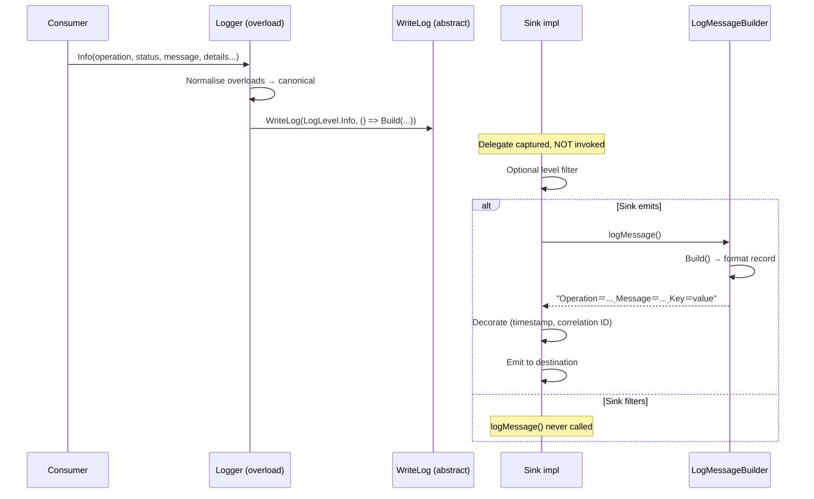

# Runtime Execution Flows

End-to-end call sequences from a consumer's log invocation through overload normalisation, lazy formatting, and sink emission.

## 📑 Table of Contents

- [Invocation Entry Points](#invocation-entry-points)
- [Canonical Dispatch](#canonical-dispatch)
- [Lazy Formatter](#lazy-formatter)
- [Sink Emission](#sink-emission)
- [Full Sequence Diagram](#full-sequence-diagram)
- [Per-Level Flow Variants](#per-level-flow-variants)
- [Async and Buffering Patterns](#async-and-buffering-patterns)
- [Failure Modes](#failure-modes)

---

## Invocation Entry Points

### Consumer Code

```csharp
logger.Info(
    Operation.UserLogin,
    OperationStatus.Success,
    "User authenticated",
    new LogInfo(AppLogKey.UserId, 12345),
    new LogInfo(AppLogKey.AccessToken, "Bearer secret-token-xyz"));
```

### Overload Resolution

The call resolves to the **most specific** matching overload in `ILogger`:

```
Info(Operation, OperationStatus, string, params LogInfo[])
```

`Logger` implements all 240 overloads. Each overload is either:

1. **A forwarding overload** — delegates to a canonical method with `null` defaults
2. **A canonical overload** — performs overload normalisation, then calls `WriteLog`

### Overload Normalisation

Every overload eventually reaches the canonical signature:

```csharp
void Info(Operation operation, OperationStatus operationStatus, string message, Exception exception, IEnumerable<LogInfo> logInfos, params LogInfo[] extraLogInfos)
```

Normalisation steps performed by the canonical overload:

| Step | Action | Example |
|------|--------|---------|
| 1 | Coalesce `logInfos` + `extraLogInfos` | `logInfos.Union(extraLogInfos)` |
| 2 | Handle `null` `logInfos` | Forward to overload without `logInfos` |
| 3 | Handle `null` `extraLogInfos` | Forward to overload without `extraLogInfos` |
| 4 | Pass fully normalised tuple to `WriteLog` | Single canonical call site |

**Result:** Exactly one `WriteLog` call per consumer invocation, regardless of which overload was invoked.

---

## Canonical Dispatch

### Canonical Methods

Each level has exactly one canonical method that performs the final dispatch:

```csharp
// Logger.cs — canonical method for Info
public void Info(Operation operation, OperationStatus operationStatus, string message, Exception exception, IEnumerable<LogInfo> logInfos, params LogInfo[] extraLogInfos)
{
    WriteLog(LogLevel.Info, () => LogMessageBuilder.Build(operation, operationStatus, message, exception, logInfos));
}
```

### Dispatch Signature

```csharp
protected abstract void WriteLog(
    LogLevel level,           // e.g. LogLevel.Info (ordinal 3)
    Func<string> logMessage   // Lazy formatter delegate
);
```

**Key design point:** `logMessage` is a **delegate**, not a string. The formatter (`LogMessageBuilder.Build`) is **not invoked** until the sink calls it.

---

## Lazy Formatter

### Why a Delegate?

```csharp
WriteLog(LogLevel.Info, () => LogMessageBuilder.Build(...));
```

The lambda is captured but **not executed** at the call site. Execution happens only when the sink invokes `logMessage()`.

### Cost Implications

| Scenario | Formatter Invoked? | Cost |
|----------|-------------------|------|
| Sink filters out the level (e.g. `if (level > LogLevel.Info) return;`) | **No** | Zero — no string allocation, no `LogInfo` processing |
| Sink emits the record | **Yes** | Full formatting cost |
| `NullLogger` | **No** | Zero — `WriteLog` body is empty |

### Consumer Benefit

Consumers can write expensive formatter code without performance penalty when the level is filtered:

```csharp
logger.Info("User {0} logged in", GetExpensiveUserName());  // GetExpensiveUserName NOT called if level filtered
```

**Note:** This is a *structural* lazy formatter — the entire record is built lazily, not individual arguments.

---

## Sink Emission

### Sink Contract

```csharp
protected abstract void WriteLog(LogLevel level, Func<string> logMessage);
```

### Emission Sequence



### Sink Responsibilities

| Responsibility | Implementation |
|----------------|----------------|
| **Level filtering** | `if (level > _minimumLevel) return;` |
| **Formatter invocation** | `string line = logMessage();` |
| **Formatting decoration** | Prepend timestamp, correlation ID, source context |
| **Destination policy** | Console, file, network, database, external service |
| **Buffering/batching** | `BlockingCollection<string>` + worker task |
| **Error handling** | `try/catch` around `logMessage()` and destination I/O |
| **Concurrency** | Own synchronisation — `Logger` provides none |
| **Resource lifecycle** | Open/close connections, dispose, shutdown flush |

### Minimal Sink

```csharp
public sealed class ConsoleLogger : Logger
{
    protected override void WriteLog(LogLevel level, Func<string> logMessage)
    {
        if (level > LogLevel.Info) return;  // Optional filter
        Console.WriteLine(logMessage());    // Invoke formatter
    }
}
```

### Null Sink

```csharp
public sealed class NullLogger : Logger
{
    protected override void WriteLog(LogLevel level, Func<string> logMessage)
    {
        // Empty body — formatter never invoked, zero cost
    }
}
```

---

## Full Sequence Diagram

Complete flow from consumer invocation to formatted output.

```mermaid
sequenceDiagram
    autonumber
    participant C as Consumer
    participant L as Logger
    participant W as WriteLog
    participant B as LogMessageBuilder
    participant D as Destination

    C->>L: Info(Operation, OperationStatus, string, LogInfo[])
    L->>L: Overload resolution (most specific)
    L->>L: Forward to canonical overload
    L->>L: Normalise: logInfos + extraLogInfos
    L->>W: WriteLog(LogLevel.Info, () => Build(...))
    Note right of W: Delegate captured; Build NOT called yet
    W->>W: Optional: level filter
    W->>B: logMessage()  [sink invokes]
    B->>B: Build(operation, status, message, exception, logInfos)
    B->>B: Append "Operation＝{Name}͵" if operation present
    B->>B: Append "OperationStatus＝{Name.ToUpper()}͵" if status present
    B->>B: GetProcessedLogInfoList(message, logInfos, exception)
    B->>B: Add Message key (message text or "An exception has occurred.")
    B->>B: Add each LogInfo: SanitiseLogInfoValue + mask if sensitive
    B->>B: Add Exception keys (type, message, stack trace)
    B->>B: GroupBy Key → first key, last value (de-dup)
    B->>B: Where value not whitespace (omit empty)
    B->>B: Append "Key＝Value͵" for each detail
    B-->>W: "Operation＝UserLogin͵OperationStatus＝SUCCESS͵Message＝...͵UserId＝12345͵AccessToken＝Bea****xyz"
    W->>W: Decorate (timestamp, source context, etc.)
    W->>D: Emit formatted line
```

---

## Per-Level Flow Variants

All six levels share the identical flow; only the `LogLevel` ordinal differs.

| Level | Ordinal | Typical Sink Filter |
|-------|---------|---------------------|
| `Fatal` | 0 | Always emit |
| `Error` | 1 | Always emit |
| `Warn` | 2 | Emit ≥ Warn |
| `Info` | 3 | Emit ≥ Info |
| `Debug` | 4 | Emit ≥ Debug |
| `Verbose` | 5 | Emit ≥ Verbose (rarely) |

### Level Filtering Example

```csharp
public sealed class ConfigurableLogger : Logger
{
    private readonly LogLevel _minimumLevel;

    public ConfigurableLogger(LogLevel minimumLevel) => _minimumLevel = minimumLevel;

    protected override void WriteLog(LogLevel level, Func<string> logMessage)
    {
        if (level > _minimumLevel) return;  // Higher ordinal = lower severity
        Console.WriteLine(logMessage());
    }
}
```

**Filtering rule:** Emit when `level <= _minimumLevel`. `LogLevel.Fatal` (0) is always emitted; `LogLevel.Verbose` (5) is filtered by default.

---

## Async and Buffering Patterns

### Pattern 1: Async Sink with Queue

```csharp
public sealed class BufferedLogger : Logger, IDisposable
{
    private readonly BlockingCollection<string> _queue = new(1000);
    private readonly Task _worker;
    private readonly CancellationTokenSource _cts = new();

    public BufferedLogger()
    {
        _worker = Task.Run(ProcessQueue, _cts.Token);
    }

    protected override void WriteLog(LogLevel level, Func<string> logMessage)
    {
        if (!_queue.TryAdd(logMessage()))  // Formatter invoked synchronously
        {
            // Backpressure policy: drop, block, or fallback
        }
    }

    private async Task ProcessQueue()
    {
        foreach (var line in _queue.GetConsumingEnumerable(_cts.Token))
        {
            await EmitAsync(line);  // Async I/O off the caller's thread
        }
    }

    public void Dispose()
    {
        _cts.Cancel();
        _queue.CompleteAdding();
        _worker.Wait();
    }
}
```

**Note:** The formatter is still invoked synchronously in `WriteLog`; only the destination I/O is async.

### Pattern 2: Deferred Formatting

```csharp
public sealed class DeferredLogger : Logger
{
    private readonly BlockingCollection<Func<string>> _queue = new(1000);
    private readonly Task _worker;

    public DeferredLogger()
    {
        _worker = Task.Run(ProcessQueue);
    }

    protected override void WriteLog(LogLevel level, Func<string> logMessage)
    {
        if (!_queue.TryAdd(logMessage))
        {
            // Backpressure: drop the delegate
        }
    }

    private void ProcessQueue()
    {
        foreach (var formatter in _queue.GetConsumingEnumerable())
        {
            string line = formatter();  // Formatting happens in worker thread
            EmitAsync(line).Wait();
        }
    }
}
```

**Use case:** When formatting is expensive and you want it off the caller's thread.

### Pattern 3: Multi-Sink Fan-Out

```csharp
public sealed class MultiLogger : Logger
{
    private readonly IReadOnlyList<Logger> _sinks;

    public MultiLogger(params Logger[] sinks) => _sinks = sinks;

    protected override void WriteLog(LogLevel level, Func<string> logMessage)
    {
        string line = logMessage();  // Format once
        foreach (var sink in _sinks)
        {
            sink.WriteLog(level, () => line);  // Reuse formatted string
        }
    }
}
```

**Note:** `Logger.WriteLog` is `protected`, not `public` — fan-out must be implemented via a different mechanism (e.g., direct destination calls or reflection).

---

## Failure Modes

### Formatter Exceptions

If `LogMessageBuilder.Build` throws (e.g., `ToString` on a custom object):

| Sink Behaviour | Code |
|----------------|------|
| **Propagate** (default) | `Console.WriteLine(logMessage());` — exception bubbles to caller |
| **Catch and log** | `try { line = logMessage(); } catch { line = "FORMAT ERROR"; }` |
| **Silently drop** | `try { line = logMessage(); } catch { }` |

**Recommendation:** Catch and degrade gracefully; a formatting failure must not lose the log record.

### Destination Exceptions

If the destination fails (network, disk full):

| Sink Behaviour | Code |
|----------------|------|
| **Propagate** | `await _httpClient.PostAsync(...)` — bubbles up |
| **Retry** | Exponential backoff loop |
| **Fallback** | Write to local file, then retry |
| **Silently drop** | `try { await Emit(line); } catch { }` |

**Recommendation:** Never silently drop in production; at minimum, log the failure to a dead-letter destination.

### Thread Safety

- `Logger` instance state (`SourceContext`) is **not thread-safe**
- `WriteLog` may be called concurrently from multiple threads
- **Sink must synchronise** if shared across threads

```csharp
public sealed class ThreadSafeLogger : Logger
{
    private readonly object _lock = new();

    protected override void WriteLog(LogLevel level, Func<string> logMessage)
    {
        lock (_lock)
        {
            Console.WriteLine(logMessage());
        }
    }
}
```

### Null Safety

- `operation`, `operationStatus`, `message`, `exception`, `logInfos` may all be `null`
- `LogMessageBuilder` handles all `null` combinations
- Sink receives a **fully-formed** string — no null checks needed

---

## Summary: Flow Checklist

| Phase | Component | Key Behaviour |
|-------|-----------|---------------|
| Invocation | `ILogger` overload | Resolves to most specific overload |
| Normalisation | `Logger` canonical method | Coalesces `logInfos` + `extraLogInfos`, handles `null` |
| Dispatch | `WriteLog` abstract | Single call per invocation; receives lazy delegate |
| Formatting | `LogMessageBuilder.Build` | Lazy — invoked only when sink calls delegate |
| Processing | `GetProcessedLogInfoList` | Sanitise, mask, de-dup, omit empty |
| Emission | Sink implementation | Filter, decorate, emit, handle errors |

**Invariant:** Exactly one `WriteLog` call per consumer invocation; formatter invoked at most once per `WriteLog`.